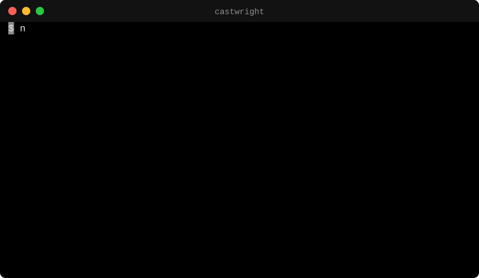
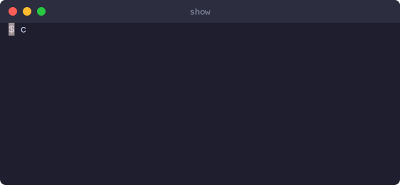
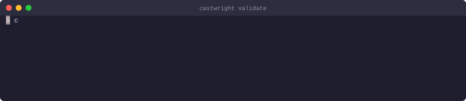

# castwright

**Declarative terminal demos for the web.**

[](https://www.npmjs.com/package/@casoon/castwright)
[](https://github.com/casoon/castwright/actions/workflows/ci.yml)
[](LICENSE)
[](package.json)

[**Live demo**](https://casoon.github.io/castwright/demo/) · [Documentation](https://casoon.github.io/castwright/)

Write a small YAML file describing a terminal session. castwright compiles it to
[asciicast v2](https://docs.asciinema.org/manual/asciicast/v2/) and plays it as a real
terminal — real ANSI, real cursor movement, selectable text — via
[xterm.js](https://xtermjs.org/), with no headless browser anywhere in your build.

<p align="center">
  
</p>

<p align="center"><sub>Every terminal image in this README is castwright's own <code>--format svg</code>
export of a file in <a href="examples/"><code>examples/</code></a> — animated, no GIF, no JavaScript.</sub></p>

```yaml
# demo.terminal.yaml
version: 1

terminal:
  cols: 72
  rows: 12
  theme: catppuccin-mocha

steps:
  - run: pnpm add -D @casoon/castwright
  - output: |
      {green}✓{/} added 3 packages
  - wait: 500
  - run: castwright build demo.terminal.yaml
  - output: |
      {dim}dist/demo.cast{/}
```

```astro
---
import TerminalDemo from '@casoon/astro-castwright/TerminalDemo.astro';
import demo from '../demos/demo.terminal.yaml';
---
<TerminalDemo demo={demo} autoplay loop />
```

## Examples

### A file on screen, highlighted at build time

[`show:`](docs/reference/dsl.md#show) puts a file into the demo with syntax highlighting —
Shiki at build time, 24-bit colour in the cast, nothing extra in the browser.

```yaml
steps:
  - run: cat astro.config.ts
  - show: snippets/astro.config.ts
```

<p align="center">
  
</p>

### A real command, recorded once

[`exec:`](docs/reference/dsl.md#exec) runs a command for real, in a pseudo-terminal the
size of the demo. `--record` then writes what it printed back into the file, so every
later build replays those exact bytes instead of running anything.

```yaml
steps:
  - exec: castwright validate broken.terminal.yaml
    cwd: snippets
```

```bash
castwright build demo.terminal.yaml --allow-exec --record
```

<p align="center">
  
</p>

That is castwright's real error output for a typo, recorded from an actual run —
[`examples/recorded.terminal.yaml`](examples/recorded.terminal.yaml) is the file `--record`
wrote.

## How it works

<p align="center">
  <picture>
    <source media="(prefers-color-scheme: dark)" srcset=".github/readme/pipeline-dark.svg">
    
  </picture>
</p>

The DSL stops existing after the compile step: everything downstream reads asciicast v2,
so the player also plays a real `asciinema rec` recording, and the asciinema tools work on
castwright's output. [`meta/architecture.md`](meta/architecture.md) has the detail.

## Why

| Tool | Authoring | Terminal | Web output |
|---|---|---|---|
| [asciinema](https://asciinema.org/) | Record a real session | Real VT | Mature player |
| [VHS](https://github.com/charmbracelet/vhs) | Declarative `.tape` | Real VT, via headless Chrome | GIF only |
| **castwright** | Declarative YAML, compiled | Real VT (xterm.js) | Framework-agnostic player, animated SVG, GIF/MP4 |

Authored rather than recorded, deterministic (same input, same bytes — a compiled cast is
a text file you can commit and read in a diff), browser-free at build time, and web-native
at output.

It is explicitly *not* a terminal recorder and *not* a terminal emulator. ANSI/VT handling
is xterm.js's job and the interchange format already exists; castwright's own substance is
the authoring language, the compiler, the player and the exporters.

## Packages

| Package | |
|---|---|
| [`@casoon/castwright`](packages/core) | Parser, compiler, the `castwright` CLI, and the Vite plugin |
| [`@casoon/castwright-player`](packages/player) | `<castwright-demo>` — the web component |
| [`@casoon/astro-castwright`](packages/astro) | Astro integration and `<TerminalDemo />` |

## Install

```bash
pnpm add -D @casoon/castwright @casoon/astro-castwright @casoon/castwright-player
```

Outside Astro, drop the middle one — the Vite plugin covers SvelteKit, Nuxt, Remix,
SolidStart, Qwik, VitePress and plain Vite:

```js
// vite.config.ts
import { castwright } from '@casoon/castwright/vite';
export default defineConfig({ plugins: [castwright()] });
```

### Server-side rendering

`@casoon/castwright-player` is safe to import from a module that also runs on the server.
Under Node it registers nothing and touches no DOM, so SvelteKit, Nuxt, Remix, SolidStart
and Qwik render the element's children — the terminal's final text — and the browser
upgrades it on hydration. That is the same fallback an undefined custom element renders
anyway, so there is nothing to mark client-only and no `ssr.noExternal` entry to add.

The pure parts (`deserializeCast`, `buildTimeline`, `toXtermTheme`) work on the server
too. `mount()` needs a real DOM and belongs in `onMount`, `useEffect` or a `<script>`.

With no bundler at all, one script tag is the whole setup:

```html
<script type="module" src="https://esm.sh/@casoon/castwright-player"></script>

<castwright-demo src="/demo.cast" autoplay loop>
  <pre>$ pnpm add -D @casoon/castwright
✓ added 3 packages</pre>
</castwright-demo>
```

## CLI

```bash
castwright build demo.terminal.yaml     # → dist/demo.cast
castwright build demo.terminal.yaml --format svg   # animated SVG for a README, no JS
castwright build demo.terminal.yaml --format gif   # via agg; mp4 via agg + ffmpeg
castwright build demo.terminal.yaml --allow-exec --record   # run exec: steps once, keep their output
castwright validate demos/*.terminal.yaml
castwright dev demo.terminal.yaml       # watch and reload while authoring
```

The output is a standard asciicast, so the rest of that ecosystem works on it —
`asciinema play`, `svg-term`, `agg`. It works the other way too: the player will happily
play a real `asciinema rec` recording.

## Accessibility

The element's children are the content: an undefined custom element renders them, so the
terminal's final text is real, selectable, screen-reader-addressable text before the
script loads and forever if it never does. The Astro component generates it at build time.
`prefers-reduced-motion` shows the final frame immediately, there is always a real pause
button, and the terminal is never a keyboard trap. Every page of the site is checked
against WCAG 2.2 AA with axe-core, in light and dark, before each release; CI runs the
player itself in a real browser on desktop and mobile viewports.

## Documentation

<https://casoon.github.io/castwright/> — guides, the DSL reference, a showcase built from
the same fixtures the tests use, and a [live demo](https://casoon.github.io/castwright/demo/)
of the player running in the page.

The source of those pages is [`docs/`](docs/); the site that renders them is
[`site/`](site/README.md).

## Status

0.2.0 is the first release. Everything described here works: the parser, compiler, CLI and
Vite plugin, the player, the Astro integration, the SVG, GIF and MP4 exporters, and the
[`show:`](docs/reference/dsl.md#show) and [`exec:`](docs/reference/dsl.md#exec) steps for
syntax-highlighted files and recorded real commands.

Before 1.0 a minor version may still change the JavaScript API. The DSL is versioned on
its own — `version: 1` in every file — and removing or repurposing a key is a breaking
change to it.

[`meta/`](meta/project-state.md) holds the maintainer-facing documentation: current state,
architecture, decisions and constraints.

## Development

```bash
pnpm install
pnpm typecheck && pnpm lint && pnpm test && pnpm build
```

Two checks run outside Vitest, because neither can be done from inside the workspace:

```bash
pnpm test:pack     # installs the three tarballs into a throwaway project
pnpm test:compat   # runs the compiler's output through asciinema and agg themselves
```

`test:compat` needs `asciinema` and `agg` on `PATH` (`brew install agg asciinema`); it
skips with a note when they are absent, and CI installs pinned versions.

```bash
pnpm --filter castwright-site dev        # the project page
pnpm --filter castwright-site test:e2e   # Playwright: the player in a real browser
```

`site/README.md` covers the pages check that runs before a release.

The images in this README are generated, not drawn:

```bash
pnpm readme:assets                         # the terminal demos, from examples/
CHROME=/path/to/chrome pnpm readme:assets  # …and the pipeline diagram, from pipeline.mmd
```

## Contributing

Issues and pull requests are welcome. The DSL is versioned: removing or repurposing a
key is a breaking change, and every new key is documented in
[`docs/reference/dsl.md`](docs/reference/dsl.md) and given an example in
[`examples/`](examples/) before it is implemented.
[`meta/conventions.md`](meta/conventions.md) has the rest of the house rules, and
[`meta/decisions.md`](meta/decisions.md) explains why the project is shaped the way it
is — worth a look before proposing anything structural.

## License

MIT © CASOON
