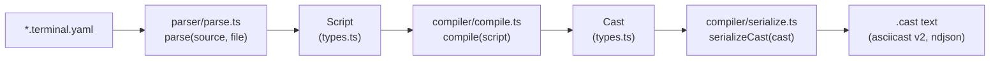
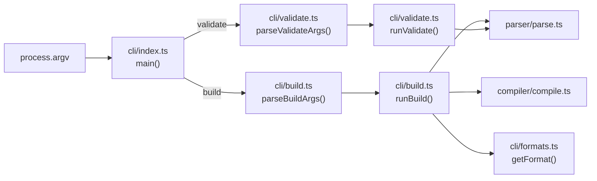
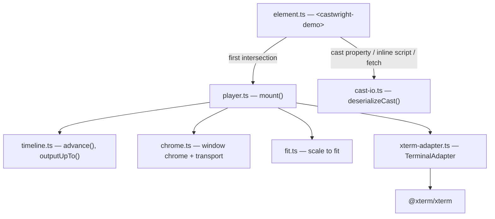

# Architecture

`*.terminal.yaml` in, a playing terminal out. Three published packages and a build-time
plugin, described here in the order data flows through them. See `project-state.md` for
what is and is not done.

## Pipeline

`Script` and `Cast` are declared once, in `packages/core/src/types.ts`, and nothing
downstream redeclares them — see the "two IR levels" decision in `decisions.md`. The
parser only ever produces a `Script`; the compiler only ever consumes one and only ever
produces a `Cast`.

## `parser/` — `*.terminal.yaml` → `Script`

Entry point: `parse(source, file, options?)` in `parser/parse.ts`.

- Walks the `yaml` package's CST (`YAMLMap`/`YAMLSeq`/`Scalar`, via `parseDocument`),
  not `doc.toJS()` — every node keeps its source range, which is what lets every error
  point at an exact `file:line:column` (`parser/errors.ts`).
- `parser/markup.ts` parses inline `{green}…{/}` markup into `Styled` (a `Span[]`).
  Called once, here — nothing downstream re-parses markup syntax.
- `parser/unescape.ts` resolves `output.raw`'s backslash escapes
  (`\e \n \r \t \xNN \uNNNN \\`).
- Validation happens inline while walking: unknown keys, the "exactly one primary key
  per step" rule, the `prompt`-as-modifier-vs-`prompt`-as-step disambiguation,
  `jitter > 0` requiring a top-level `seed`, and the `terminal.theme` name against
  `themes/index.ts`'s registry.
- `run` is lowered here into two `Script` steps — `{kind:'type', prompt:true}` followed
  by `{kind:'key', key:'enter'}` — so the compiler never sees `run` at all.

## `compiler/` — `Script` → `Cast`

Entry point: `compile(script)` in `compiler/compile.ts`.

- A single mutable `Ctx` (accumulated integer-millisecond clock `t`, the events array,
  the "current prompt") is threaded through one function per step kind
  (`compileType`, `compileKey`, `compileOutput`, `compileClear`, `compileMarker`, and
  the `prompt`/`wait` cases handled inline).
- `compiler/graphemes.ts` segments typed text by grapheme cluster (`Intl.Segmenter`),
  not UTF-16 code unit.
- `compiler/sgr.ts` converts a `Span` to its SGR prefix/suffix — the one function
  shared by the prompt, `type` text and `output`.
- `compiler/lines.ts` splits a `Styled` block into per-line `Styled` arrays for
  `output`'s `lineDelay > 0` path.
- `compiler/prng.ts` (mulberry32) is the sole source of randomness, used only for
  `jitter`, seeded from `Script.seed` — the parser guarantees a seed exists whenever
  jitter is used.
- `compiler/keys.ts` maps `KeyName` to the bytes a terminal receives for that key.
- `themes/index.ts` resolves `Script.terminal.theme` to a `CastTheme`, embedded in the
  cast header. The same registry is read by the parser (to validate the name) and the
  compiler (to resolve it) — it is not part of the player's dependency graph; a `Cast`
  carries its own theme, so the player never needs the name-to-palette table (see
  "player has no runtime dependency on `core`" in `decisions.md`).
- All emitted bytes pass through one function, `Ctx.pushOutput`, which is the single
  place `\n` is normalised to `\r\n` (via a negative-lookbehind regex, safe to apply to
  already-`\r\n` text without corrupting it).

## `compiler/serialize.ts` — `Cast` → text

`serializeCast(cast)` writes the header as one JSON line, then one compact JSON array
per event — plain asciicast v2 newline-delimited JSON. No other module produces the
on-disk `.cast` format.

## Determinism

`compile()` never reads the clock, the filesystem, or any other ambient state — the
`Script` is its only input. Two `compile()` calls on the same `Script` (even without a
shared `Ctx`) produce byte-identical `Cast`s, verified for the whole `examples/` corpus
by `packages/core/src/compiler/__tests__/examples.compile.test.ts`, which snapshots
each compiled `.cast` to a committed file under that test's `__snapshots__/` — a real,
diffable build artifact, not an opaque inline snapshot.

## `cli/` — the `castwright` bin

Entry point: `cli/index.ts` (the package's `bin`). A thin dispatcher — argument
parsing and the actual work are separate, testable functions so nothing here needs
`process.exit` or a live filesystem to test:

- `cli/formats.ts` is a registry (`Record<string, OutputFormat>`), not an `if` chain —
  exporters are entries here (`cast`, `svg`, `gif`, `mp4`), not branches in `build.ts`.
  A renderer may be async and may return bytes; `runBuild` awaits it.
- Two steps can only be resolved with I/O, so they run between `parse()` and `compile()`
  and are replaced by ordinary steps there, keeping `compile()` synchronous and pure:
  `exec/resolve.ts` runs `exec:` commands in a node-pty PTY (only with `allowExec`) and
  turns each into `type` + `key` + `output`/`wait` steps with the recorded timing;
  `show/resolve.ts` highlights `show:` files with Shiki into `output` steps.
  `exec/record.ts` writes a run back into the YAML document for `--record`. The CLI and
  the Vite plugin call both; `compile()` refuses an unresolved step.
- `tape/parse.ts` is a second front end: it reads a VHS `.tape` into the same Script IR.
  With `exec` set, a typed line ending in `Enter` becomes an `exec:` step, and lines typed
  while hidden become its silent `setup`. The CLI and the Vite plugin choose the parser by
  file extension (`isTapeFile()`); nothing after parsing knows a tape was the source.
- `exporters/svg.ts` replays the cast into `@xterm/headless`, snapshots the screen per
  frame (changes under 30 ms merged) and defines each distinct row once. Timelines follow
  buffer lines, not frames: each line of the normal buffer sits at its index on one tall
  strip and animates only when its content changes, scrolling is one timeline moving the
  strip, and the cursor has its own. The alternate buffer's rows are fixed to the screen.
  Printable ASCII is grouped into runs pinned with `textLength`; any other glyph gets its
  own `<text>` at its column, since `textLength` spreads a width difference across a run. `exporters/raster.ts` shells out to `agg` (GIF)
  and `ffmpeg` (GIF → MP4); a missing tool throws `ExternalToolError`.
- `cli/errors.ts`'s `CliUsageError` (a bad flag), `parser/errors.ts`'s
  `CastwrightParseError` (a mistake in the DSL file) and `exporters/raster.ts`'s
  `ExternalToolError` (agg/ffmpeg missing or failing) are the error types
  `index.ts` catches and prints as a single clean message with no stack trace;
  anything else is treated as an internal bug and left to crash with one.
- `validate` checks every given file, not just the first failure, and exits non-zero
  only on an actual error — a warning (e.g. an `output` line wider than `terminal.cols`)
  is printed but does not fail the command.
- `dev` serves one demo and reloads it on save, built on Vite — which already resolves
  the bare imports the player needs, already watches, and is already an optional peer
  dependency. It is imported lazily (`cli/dev.ts`, with argument parsing split into
  `cli/dev-args.ts`) so `build` and `validate` keep working where Vite is not installed.

## `vite/` — build-time compilation

`@casoon/castwright/vite` is a plain Vite plugin: a `*.terminal.yaml` import becomes
`{ cast, finalFrame }`. It is what makes castwright framework-agnostic — Astro,
SvelteKit, Nuxt, Remix, SolidStart, Qwik and VitePress all go through it.

- A `CastwrightParseError` is re-thrown with Vite's `loc`, so a DSL mistake is a **build**
  error with file, line and column rather than a blank box at runtime.
- `vite` is a type-only peer dependency; the plugin is a plain object and nothing from
  vite is imported at runtime.
- `types/vite-client.d.ts` types the import. It is hand-written and shipped as-is rather
  than compiled, so `@casoon/castwright/vite/client` resolves without a build having run.

## `@casoon/castwright-player` — the browser half

- `element.ts` owns *when*: lazy initialisation on first intersection, pausing when
  scrolled out of view, and resolving the cast from one of three sources.
- `player.ts` owns *what*: the clock, the state machine, and the rule that seek is a
  replay rather than a skip — terminal state is cumulative, so jumping to a moment means
  re-feeding every byte up to it with timing suppressed.
- Everything xterm-specific is confined to `xterm-adapter.ts`, behind `TerminalAdapter`.
  That is what lets the player's behaviour be asserted against a fake terminal in
  `happy-dom`, with real-browser coverage left to Playwright.
- The player has **no runtime dependency on `core`**. A cast is self-describing, so
  `cast-io.ts` re-implements ~15 lines of the serializer in reverse rather than creating
  that edge.
- `styles.ts` carries both the player's CSS and xterm's, the latter generated from the
  installed package by `scripts/generate-xterm-css.mjs`, so a plain HTML page needs one
  script tag and no second file. It is adopted as a constructed stylesheet, not a `<style>`
  element, so a strict `style-src` does not block it.
- `csp.ts` keeps xterm's own run-time styling alive under such a policy: its `<style>`
  elements are mirrored into constructed sheets and refused `style` attributes are
  re-applied through the CSSOM. The adapter starts it on `open()` and stops it on
  `dispose()`.

## `@casoon/astro-castwright` — Astro ergonomics

Registers the Vite plugin and adds `TerminalDemo.astro`, which inlines the compiled cast
as JSON, emits `finalFrame` as the element's light-DOM accessibility fallback, and
reserves the terminal's height so hydration does not shift the page. It contains no
terminal logic; both halves work in Astro without it.

## Verification that spans the whole pipeline

- `examples/astro` and `examples/vite` are built in CI and assert **against their real
  bundles** that the parser, the compiler and `@xterm/headless` never reach the browser,
  that the cast is inlined rather than fetched, and that a non-empty fallback ships.
- `site/` is the project page, built from the shared CASOON Pages theme. Its Playwright
  suite drives real xterm.js in a real browser, and the theme's own check script runs
  axe over every page in light and dark before a release. Its showcase and hero terminal
  are produced by castwright's own compiler at build time, from the same `examples/`
  fixtures the unit tests use — so a change in compiler output shows up on the page.
  Every player on the site goes through one registry (`site/src/demos.ts`) and one
  component (`Cast.astro`); the docs' MDX reaches it through the theme's
  `mdxComponents` option, since `docs/` cannot import. `examples/vhs.tape` runs its
  commands during the site build (`allowExec`); the SVGs shown as `` are built by
  the CLI in `prebuild`.

